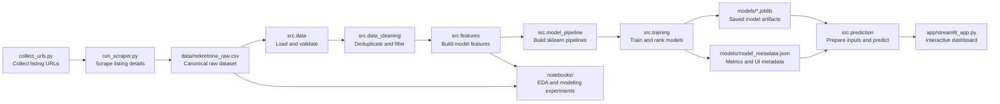

# CS490 Project: Real Estate Price Prediction

A real-estate market analysis and advertised-price prediction system built for CS490. The project combines web scraping, data validation, data cleaning, feature engineering, regression model training, saved model artifacts, and a Streamlit dashboard for interactive price estimation.

## Table of Contents

- [Project Overview](#project-overview)
- [Dataset](#dataset)
- [Features](#features)
- [Model Results](#model-results)
- [Installation](#installation)
- [Running the Project](#running-the-project)
- [Project Structure](#project-structure)
- [Architecture and Data Flow](#architecture-and-data-flow)
- [Testing](#testing)
- [Scraper](#scraper)
- [Notes and Limitations](#notes-and-limitations)

## Project Overview

The goal of this project is to build a complete machine learning workflow for real-estate listings:

1. collect listing data from `nekretnine.rs`,
2. validate and clean the raw CSV dataset,
3. engineer model-ready features from numeric, categorical, and text fields,
4. train and compare multiple regression models,
5. save the best model and supporting metadata,
6. expose predictions and analysis through a Streamlit dashboard.

The repository is organized as a small production-style ML project. The scraper, data pipeline, model training code, prediction helpers, notebooks, tests, and web dashboard are separated into reusable modules.

## Dataset

The canonical dataset is stored at:

```text
data/nekretnine_raw.csv
```

The dataset was collected with a custom scraper for `nekretnine.rs`. The current saved model metadata reports:

- **20,584** raw listings,
- **18,651** rows after deduplication and quality filters,
- **14,920** training rows,
- **3,731** test rows.

The raw dataset contains 13 base columns:

- `title`
- `description`
- `area_m2`
- `price_eur`
- `city`
- `region`
- `street`
- `heating_type`
- `rooms`
- `parking`
- `floor`
- `year_built`
- `url`

The detailed dataset schema and derived columns are documented in [`docs/dataset_schema.md`](docs/dataset_schema.md).

### Model Input Columns

The model uses the following features:

- numeric and boolean-like features: `area_m2`, `rooms`, `floor`, `total_floors`, `is_last_floor`, `year_built`, `building_age`, `is_lux`, `is_penthouse`, `is_duplex`,
- categorical features: `city`, `region`, `city_region`, `heating_type`, `parking`.

The derived column `price_per_m2` is useful for analysis and visualization, but it is intentionally excluded from the model inputs because it is calculated from the target column `price_eur` and would cause target leakage.

## Features

- **Dataset validation** — checks expected columns, minimum row count, and parseable numeric values.
- **Data cleaning** — deduplicates listings and filters unrealistic area, price, room-count, and construction-year values.
- **Feature engineering** — parses floor information, estimates total floors, detects last-floor listings, calculates building age, combines city and region into a location interaction, and extracts text signals such as luxury, penthouse, and duplex indicators.
- **Model pipeline** — uses numeric imputation, numeric scaling, categorical imputation, one-hot encoding, optional log-target training, and CatBoost for native categorical modeling.
- **Model comparison** — trains and compares baseline, linear, regularized, tuned tree-based, boosting, log-target, and CatBoost regressors.
- **Model registry** — stores the best model, all trained models, metrics, UI options, feature contract, and cleaning summary.
- **Streamlit dashboard** — provides an interactive prediction form, exploratory data analysis views, model-comparison charts, and a project overview.
- **Unit tests** — cover data loading, cleaning, feature engineering, preprocessing, training, prediction, scraper utilities, notebooks, and the Streamlit dashboard.

## Model Results

The best currently saved model is **ExtraTreesRegressor** with tuned tree parameters and the added `city_region` feature.

| Metric |       Value |
| ------ | ----------: |
| MAE    | ~28,505 EUR |
| RMSE   | ~55,839 EUR |
| R²     |      ~0.860 |

Model artifacts are stored in [`models/`](models/):

- `models/real_estate_price_pipeline.joblib` — the best saved pipeline,
- `models/real_estate_model_registry.joblib` — the registry of all trained models,
- `models/model_metadata.json` — metrics, feature contract, UI options, and cleaning summary.

## Installation

The project uses [`uv`](https://docs.astral.sh/uv/) for dependency management. Python **3.10+** is required; the local project version is pinned to `3.10` through `.python-version`.

```bash
# Clone the repository
git clone <repo-url>
cd CS490-Projekat

# Install dependencies
uv sync
```

Optionally activate the virtual environment:

```bash
source .venv/bin/activate
```

The main dependencies include `pandas`, `scikit-learn`, `catboost`, `streamlit`, `matplotlib`, `seaborn`, `beautifulsoup4`, `requests`, `joblib`, `jupyter`, and `tqdm`. The full dependency list is defined in [`pyproject.toml`](pyproject.toml).

## Running the Project

### Streamlit Dashboard

```bash
uv run app
```

Equivalent command:

```bash
uv run streamlit run app/streamlit_app.py
```

The dashboard has four main sections:

- **Price Prediction** — enter property attributes and estimate the advertised price,
- **Data** — inspect the dataset and exploratory visualizations,
- **Models** — compare trained models and metrics,
- **About the Project** — review the project purpose and architecture.

If model artifacts are missing, train the models first.

### Model Training

```bash
uv run train
```

Equivalent command:

```bash
uv run python -m src.training
```

The training command loads `data/nekretnine_raw.csv`, cleans the dataset, creates features, trains model candidates, ranks them by MAE, and writes artifacts to `models/`.

> Note: retraining can overwrite the existing files in `models/`.

### Notebooks

```bash
uv run jupyter notebook notebooks/analysis.ipynb
uv run jupyter notebook notebooks/modeling_activities_04_05.ipynb
```

The notebooks document exploratory data analysis, preprocessing, baseline modeling, and the expanded model comparison.

## Project Structure

```text
.
├── app/
│   └── streamlit_app.py                 # Streamlit dashboard
├── data/
│   ├── listing_urls.txt                 # Scraped listing URL provenance
│   └── nekretnine_raw.csv               # Canonical raw dataset
├── docs/
│   └── dataset_schema.md                # Dataset schema and model input contract
├── models/
│   ├── model_metadata.json              # Metrics, features, and UI options
│   ├── real_estate_model_registry.joblib
│   └── real_estate_price_pipeline.joblib
├── notebooks/
│   ├── analysis.ipynb                   # EDA and preprocessing
│   └── modeling_activities_04_05.ipynb  # Model training and comparison
├── scraper/
│   ├── collect_urls.py                  # Listing URL collection
│   └── run_scraper.py                   # Listing-detail scraping into CSV
├── src/
│   ├── commands.py                      # uv script entry points
│   ├── data.py                          # Dataset loading and validation
│   ├── data_cleaning.py                 # Deduplication and quality filters
│   ├── evaluation.py                    # MAE/RMSE/R² evaluation
│   ├── features.py                      # Feature engineering
│   ├── model_pipeline.py                # sklearn pipelines and regressors
│   ├── prediction.py                    # Input validation and inference
│   ├── preprocessing.py                 # Preprocessing helpers for activities
│   └── training.py                      # Training, evaluation, and artifact saving
├── tests/                               # unittest test suite
├── pyproject.toml                       # Project metadata, dependencies, and scripts
└── uv.lock                              # Locked dependency versions
```

## Architecture and Data Flow



### System Layers

- **Data layer** — CSV dataset, schema documentation, and loader/validator code in `src/data.py`.
- **Cleaning and feature layer** — `src/data_cleaning.py` and `src/features.py`.
- **Modeling layer** — `src/model_pipeline.py`, `src/training.py`, and `src/evaluation.py`.
- **Prediction layer** — `src/prediction.py`, which converts app inputs into the same feature contract used during training.
- **Presentation layer** — `app/streamlit_app.py`.

## Testing

Run the full test suite:

```bash
uv run test
```

Equivalent command:

```bash
uv run python -m unittest discover -s tests
```

The tests cover:

- dataset loading and validation,
- cleaning and preprocessing,
- feature engineering,
- model training and evaluation,
- prediction helpers,
- scraper scripts,
- notebook deliverables,
- Streamlit dashboard behavior.

## Scraper

The scraper is included for dataset reproduction and extension, but it is not required for normal dashboard usage because the project already includes the canonical dataset at `data/nekretnine_raw.csv`.

Collect new listing URLs:

```bash
uv run python scraper/collect_urls.py
```

Scrape listing details:

```bash
uv run python scraper/run_scraper.py
```

By default, the scraper writes new outputs under `data/new_scrape/`, while training and the app use `data/nekretnine_raw.csv`. If you want to train on a new scrape, verify that the generated CSV matches the expected schema and update the data path or file location accordingly.

## Notes and Limitations

- The scraper depends on the current HTML structure of `nekretnine.rs`; it may need updates if the website changes.
- The dataset contains listing prices, not final sale prices, so the model predicts advertised prices.
- Prediction quality depends on city and region coverage, listing-description quality, and available attributes.
- Saved model artifacts are relatively large. If they are missing from a local copy, regenerate them with `uv run train`.
